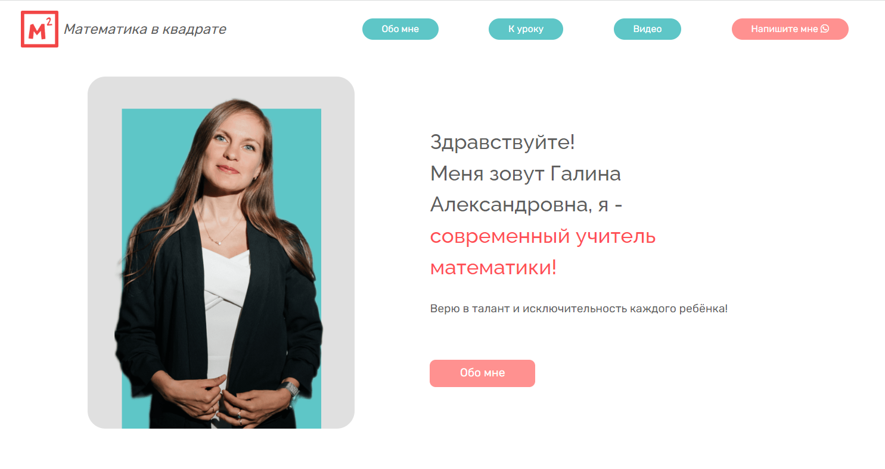
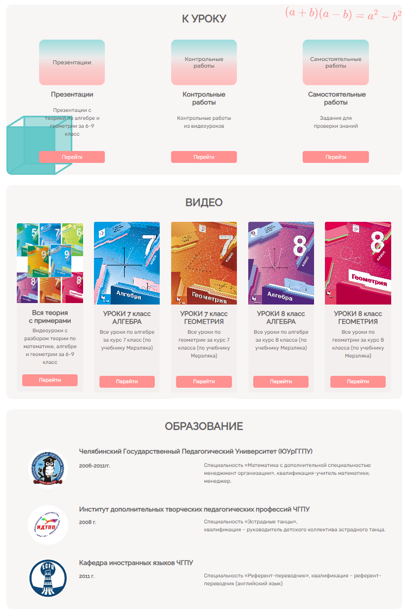
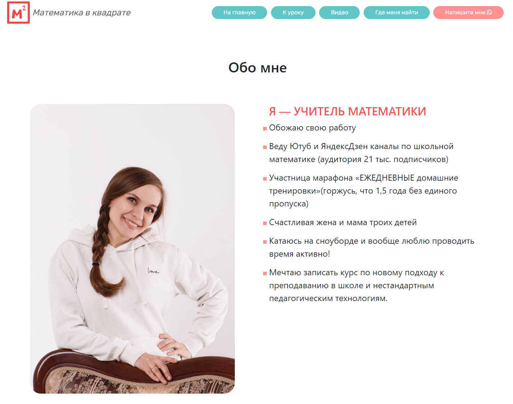
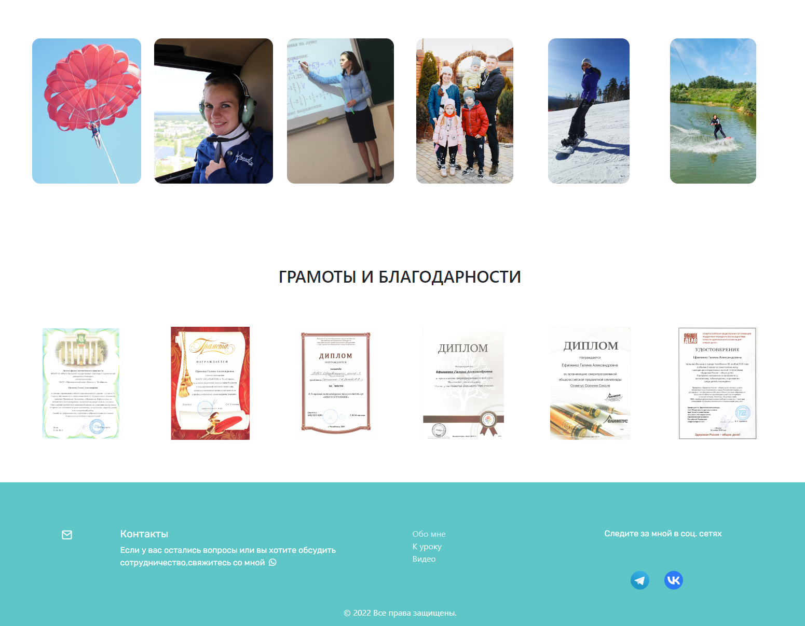
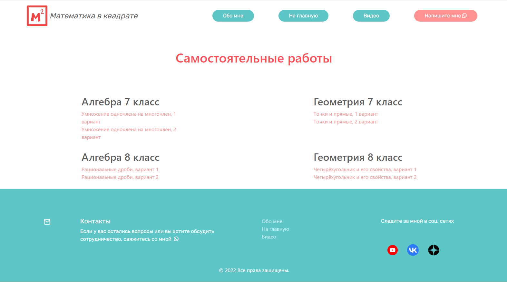

# Математика в квадрате (Math in Square)

Website for a modern math teacher

## Description

This project is a website for the modern math teacher with educational content for the pupils of 6-9 grades.

At the first page we meet the teacher and find out what is her work about.

or more information about the person, user can go to the page 'About' clicking on the button 'Обо мне' or using navigaton menu in a header.

Main blocks consist cards with a short description of content. 

Block 'К уроку (For the lesson)' is a navigation to the pages where user can find tests and presentations describing different concepts from math, algebra and geometry.
Cards in the block 'Video (Видео)' lead to the pages of a third party site, where user can find video-lessons and video-solutions of the tests

## Technology stack

## Result

[Сlick me](https://tintinelle.github.io/Mathteacher-website/)

 

## Authors

Mariya Zeleneva 
[@MZ-87](https://github.com/MZ-87)

Ilvina Rakhimova 
[@tintinelle](https://github.com/tintinelle)

Aleksandra Mosyagina 
[@aleksandramosyagina](https://github.com/aleksandramosyagina)

Daniya Shagieva  
[@ShaDaniya](https://github.com/ShaDaniya)

lisa_ywl 
[@yourworthlesslife](https://github.com/yourworthlesslife)

